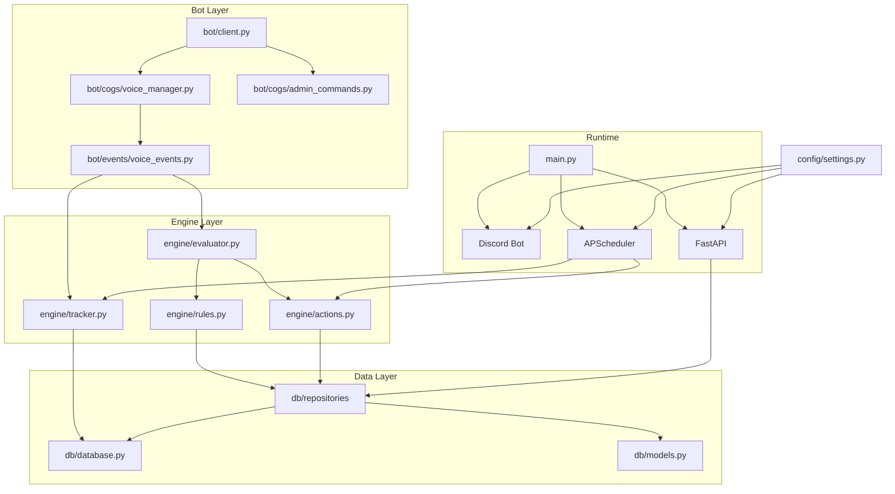
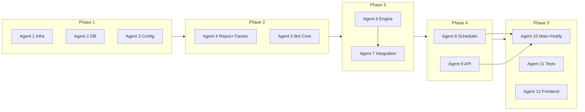

# Подробный план: Discord Voice Channel Manager Bot

Исходный документ: [discord-voice-bot-plan.md](d:\Downloads\Firefox_downloads\discord-voice-bot-plan.md).

---

## Часть I. Архитектура и зависимости

### Схема компонентов

### Порядок зависимостей модулей

- **config**, **utils** — не зависят от остального кода.
- **db** (database, models) — основа для репозиториев и миграций.
- **db/repositories** — зависят от db (database, models).
- **engine/tracker** — зависит от db (database, models или репозиториев для voice_sessions).
- **engine/rules, actions, evaluator** — зависят от repositories и (для actions) от discord.py.
- **bot** — зависит от config, engine (tracker, evaluator, actions).
- **scheduler** — зависит от engine (tracker, actions), repositories, config.
- **api** — зависит от config, db (repositories), schemas.
- **main** — собирает bot + api + scheduler + LISTEN/NOTIFY.

---

## Часть II. Подробная пошаговая реализация по спринтам

---

### Sprint 1 — Фундамент

#### 1.1 Инициализация проекта и структура каталогов

**Цель:** готовая структура папок и файлов без логики.

**Действия:**

- Создать в корне (например `mvp_ds_bot/` или `discord-voice-bot/`) каталоги:
  - `src/`, `src/bot/`, `src/bot/cogs/`, `src/bot/events/`
  - `src/engine/`, `src/scheduler/`, `src/api/`, `src/api/routers/`
  - `src/db/`, `src/db/repositories/`, `src/config/`, `src/utils/`
  - `alembic/`, `alembic/versions/`, `tests/`, `tests/test_engine/`, `tests/test_api/`, `tests/test_bot/`, `scripts/`
- Во всех пакетах создать пустые `__init__.py` (или с минимальным реэкспортом).
- Файлы в корне: `docker-compose.yml`, `Dockerfile`, `.env.example`, `config.yaml`, `requirements.txt` или `pyproject.toml`.

**Файл `requirements.txt` (минимальный набор для MVP):**

- discord.py>=2.3.0
- fastapi>=0.104.0
- uvicorn[standard]>=0.24.0
- asyncpg>=0.29.0
- sqlalchemy[asyncio]>=2.0.0
- alembic>=1.12.0
- pydantic>=2.0.0
- pydantic-settings>=2.0.0
- pyyaml>=6.0
- apscheduler>=3.10.0
- structlog>=23.0.0
- python-jose[cryptography]
- passlib[bcrypt]
- httpx
- pytest
- pytest-asyncio

**Критерий готовности:** по структуре можно однозначно положить каждый модуль из плана в свой файл.

---

#### 1.2 Docker и конфигурация окружения

**Файл `docker-compose.yml`:**

- Сервис `db`: образ `postgres:16-alpine`, переменные `POSTGRES_USER`, `POSTGRES_PASSWORD`, `POSTGRES_DB`, volume для данных, порт 5432, healthcheck через `pg_isready -U bot`.
- Сервис `bot`: `build: .`, `env_file: .env`, `depends_on: db (condition: service_healthy)`, volume `./config.yaml:/app/config.yaml:ro`, `restart: unless-stopped`. Рабочая директория и команда запуска — по соглашению (например `python -m src.main` или `uvicorn` + бот в одном процессе).

**Файл `Dockerfile`:**

- Базовый образ Python 3.11+ (slim или alpine).
- Установка зависимостей из requirements.txt.
- Копирование `src/`, `alembic/`, `config.yaml`, `alembic.ini` в образ.
- WORKDIR `/app`, CMD для запуска приложения (см. main).

**Файл `.env.example`:**

- DISCORD_TOKEN=your_bot_token
- DISCORD_GUILD_ID=123456789
- DATABASE_URL=postgresql+asyncpg://bot:password@db:5432/voice_bot
- API_HOST=0.0.0.0
- API_PORT=8000
- API_SECRET_KEY=your_secret_for_jwt
- SCHEDULER_CHECK_INTERVAL=30
- DEFAULT_TIMEZONE=Europe/Moscow

**Файл `config.yaml`:**

- Секции из плана: `bot` (command_prefix, status), `defaults` (max_channel_time_sec, mute_on_blacklist_join, kick_on_blacklist_join), `channels` (monitored, move_target), `logging` (level, format).

**Критерий готовности:** `docker-compose up -d db` поднимает PostgreSQL и проходит healthcheck; приложение можно запускать с этим .env и config.yaml.

---

#### 1.3 PostgreSQL, модели, Alembic

**Файл `src/db/models.py` (SQLAlchemy 2.0, async):**

- Таблица `user_lists`: id (SERIAL PK), discord_id (BIGINT), username (VARCHAR 100), list_type (VARCHAR 10, 'whitelist'|'blacklist'), reason (TEXT), created_at, updated_at (TIMESTAMPTZ), UNIQUE(discord_id, list_type).
- Таблица `rules`: id, name, description, is_active, target_list, channel_ids (ARRAY(BIGINT)), max_time_sec (INT), action_type (VARCHAR 20), action_params (JSONB), schedule_cron, schedule_tz, priority, created_at, updated_at.
- Таблица `action_logs`: id, rule_id (FK rules), discord_id, action_type, channel_id, details (JSONB), executed_at. Индексы: discord_id, executed_at.
- Таблица `voice_sessions`: id, discord_id, channel_id, joined_at, left_at (nullable), при необходимости computed duration_sec. Индекс по (discord_id) WHERE left_at IS NULL.
- Таблица `schedules`: id, rule_id (FK rules ON DELETE CASCADE), cron_expr, action ('enable'|'disable'), timezone, is_active, created_at.

**Файл `src/db/database.py` (первая версия):**

- Чтение DATABASE_URL из настроек (или os.environ).
- Создание asyncpg connection pool (asyncpg.create_pool).
- Функции: get_pool(), get_connection() (async context manager), при необходимости init_db() для проверки подключения.
- LISTEN/NOTIFY — не реализовывать в этом шаге (добавится в Sprint 3).

**Alembic:**

- `alembic.ini`: sqlalchemy.url — из переменной окружения или из конфига приложения; script_location = alembic.
- `alembic/env.py`: async run_migrations (use asyncio.run или уже внутри async контекста), target_metadata = models.Base.metadata, подключение к БД через asyncpg/url из config.
- Первая миграция `alembic/versions/xxx_create_tables.py`: создание всех пяти таблиц и индексов по плану (включая partial index для voice_sessions).

**Критерий готовности:** миграция применяется без ошибок; модели соответствуют схеме из плана; database.py даёт пул подключений.

---

#### 1.4 Конфиг и утилиты

**Файл `src/config/settings.py`:**

- Pydantic Settings: загрузка из .env (env_file=".env").
- Поля: DISCORD_TOKEN, DISCORD_GUILD_ID, DATABASE_URL, API_HOST, API_PORT, API_SECRET_KEY, SCHEDULER_CHECK_INTERVAL, DEFAULT_TIMEZONE.
- Опционально: загрузка config.yaml (PyYAML) и объединение с defaults для bot/defaults/channels/logging — либо отдельный объект ConfigYaml, либо вложенные поля в Settings.

**Файл `src/utils/logging.py`:**

- Настройка structlog: JSON renderer для production, уровень из config (logging.level), привязка к стандартному logging при необходимости.

**Файл `src/utils/permissions.py`:**

- Функция проверки прав бота в guild/канале: например can_mute(member), can_move(member), can_kick(member) через разрешения канала/гильдии (discord.Permissions). Используется в actions.

**Критерий готовности:** приложение может загрузить настройки и инициализировать логгер; permissions можно вызывать, передав mock member/guild.

---

#### 1.5 Базовый Discord-бот и голосовые события

**Файл `src/bot/client.py`:**

- Создание экземпляра discord.Client или commands.Bot с intents: GUILDS, GUILD_VOICE_STATES, GUILD_MEMBERS (privileged).
- Загрузка cogs: voice_manager (и при наличии admin_commands).
- Обработчик on_ready: логирование имени бота и количества гильдий.
- Функция run(token) или start() — client.run(token).

**Файл `src/bot/cogs/voice_manager.py` (Cog):**

- Listener `on_voice_state_update(member, before, after)`:
  - Если after.channel — пользователь зашёл или переместился: логировать join/move (member.id, channel.id).
  - Если before.channel и не after.channel — вышел: логировать leave.
  - Пока не вызывать tracker и не evaluator — только логирование.

**Файл `src/bot/events/voice_events.py` (опционально):**

- Можно вынести логику обработки в отдельные функции (on_voice_join, on_voice_leave), вызываемые из cog, чтобы позже подставить вызовы tracker и evaluator.

**Файл `src/bot/cogs/admin_commands.py` (заглушка):**

- Пустой Cog или одна slash-команда /ping для проверки регистрации команд.

**Точка входа (временная):**

- Простой скрипт или `src/main.py`: загрузка config, инициализация логгера, запуск бота (client.run). Без FastAPI и scheduler.

**Критерий готовности:** бот подключается к Discord, при входе/выходе пользователя из войса в логах есть запись о событии.

---

#### 1.6 Трекер времени в каналах

**Файл `src/engine/tracker.py`:**

- In-memory хранилище активных сессий: словарь (discord_id, channel_id) -> joined_at (datetime).
- start_session(discord_id, channel_id): записать в память; вставить строку в voice_sessions (joined_at=NOW(), left_at=NULL). Использовать pool из database.
- end_session(discord_id, channel_id): обновить voice_sessions SET left_at=NOW() WHERE discord_id AND channel_id AND left_at IS NULL; удалить из памяти.
- get_current_sessions(): возврат списка (discord_id, channel_id, joined_at) из памяти или из БД.
- Интерфейс для overtime (Sprint 3): get_overtime_users(rules) — пока заглушка или пустая реализация: по правилам с max_time_sec и текущим сессиям вернуть список {discord_id, channel_id, rule, overtime_seconds}.

**Соглашение по зависимостям:** tracker принимает pool (или async session) в конструкторе/фабрике, либо получает его из глобального состояния приложения — по выбору архитектуры (dependency injection предпочтительнее).

**Критерий готовности:** при вызове start_session и end_session в БД появляются и обновляются записи voice_sessions; после рестарта можно восстановить активные сессии из БД (reconcile при старте — опционально в этом спринте).

---

#### 1.7 Базовые тесты (Sprint 1)

- **tests/conftest.py:** фикстуры pytest, pytest-asyncio (event_loop), при необходимости фикстура БД (временная SQLite/Postgres с тестовой БД или моки).
- **tests/test_bot:** тест, что при вызове on_voice_state_update с mock member/before/after не падает и логируется (mock logger).
- **tests/test_engine/test_tracker.py:** тесты start_session, end_session (с тестовой БД или моком pool), проверка записей в voice_sessions.
- **tests для models:** при необходимости проверка маппинга (создание записи и чтение) — можно в test_db или test_engine.

**Критерий готовности:** pytest запускается, тесты для tracker и голосовых событий проходят.

---

### Sprint 2 — Движок правил

#### 2.1 Репозитории (правила, пользователи, логи)

**Файл `src/db/repositories/rules_repo.py`:**

- get_active_rules(channel_id: int | None) -> list[RuleRow]: выборка из rules WHERE is_active AND (channel_ids IS NULL OR channel_id = ANY(channel_ids)), ORDER BY priority.
- get_rule_by_id(rule_id: int), create_rule(data), update_rule(rule_id, data), delete_rule(rule_id). Данные в формате dict или Pydantic; маппинг в таблицу rules.

**Файл `src/db/repositories/users_repo.py`:**

- get_user_lists(list_type: 'whitelist'|'blacklist') -> list[UserListRow].
- is_in_list(discord_id: int, list_type: str) -> bool.
- add_user(discord_id, list_type, username=None, reason=None), remove_user(discord_id, list_type), bulk_add(entries: list).

**Файл `src/db/repositories/logs_repo.py`:**

- log_action(rule_id, discord_id, action_type, channel_id, details: dict).
- get_logs(filters: dict, limit, offset): фильтры по discord_id, rule_id, action_type, date_from, date_to; возврат списка записей.

**Файл `src/db/repositories/schedules_repo.py`:**

- get_active_schedules(), create_schedule(rule_id, cron_expr, action, timezone), delete_schedule(schedule_id). Используется в Sprint 3.

**Критерий готовности:** все репозитории вызываются без ошибок; правила и списки пользователей можно читать и писать через репозитории.

---

#### 2.2 Модели правил в коде (engine)

**Файл `src/engine/rules.py`:**

- Класс Rule (dataclass или Pydantic): id, name, is_active, target_list, channel_ids, max_time_sec, action_type, action_params (dict), priority. Преобразование из строки БД (target_list, channel_ids, action_params) в типизированную структуру.
- RuleSet или функция load_rules_for_channel(channel_id, rules_repo) -> list[Rule] — обёртка над rules_repo.get_active_rules.

**Критерий готовности:** по channel_id можно получить список Rule с корректными типами.

---

#### 2.3 Модуль действий (actions)

**Файл `src/engine/actions.py`:**

- execute_action(action_type: str, member: discord.Member, params: dict, guild) -> bool | None:
  - mute: member.edit(mute=True); при отсутствии прав или ошибке (например пользователь вышел) — try/except, логирование, return False.
  - unmute: member.edit(mute=False).
  - move: target_channel_id = params.get("target_channel_id"); channel = guild.get_channel(...); member.move_to(channel).
  - kick: member.move_to(None) — отключение от голосового канала.
- Проверка прав бота через utils.permissions (can_mute, can_move, can_kick) перед действием.
- Защита: если member.id == guild.owner_id — не выполнять действие, вернуть False.

**Критерий готовности:** вызов execute_action с mock member/guild не падает; при реальном боте действия выполняются при наличии прав.

---

#### 2.4 Оценщик правил (evaluator)

**Файл `src/engine/evaluator.py`:**

- evaluate(member: discord.Member, channel: discord.VoiceChannel, rules: list[Rule], users_repo, logs_repo) -> list[ActionToRun]:
  - Для каждого правила: проверить target_list (whitelist/blacklist) — если правило для blacklist, проверить users_repo.is_in_list(member.id, 'blacklist'); для whitelist — аналогично.
  - Если правило сработало (например blacklist и пользователь в blacklist): сформировать ActionToRun(action_type, params, rule_id). Если правило с max_time_sec — не выполнять сразу, а вернуть флаг "нужен таймер" (scheduler будет обрабатывать позже).
  - Решить приоритет: какое действие выполнить первым (например kick выше mute), вернуть упорядоченный список действий.
- Сигнатура может быть упрощена: evaluate возвращает одно действие или список; вызывающая сторона (voice_events) выполняет через actions.execute_action и логирует через logs_repo.

**Критерий готовности:** при передаче member в blacklist и правила "kick" evaluator возвращает действие kick; при отсутствии в списке — пустой список.

---

#### 2.5 Интеграция движка в голосовые события

**В `src/bot/cogs/voice_manager.py` или `src/bot/events/voice_events.py`:**

- При входе в канал (after.channel is not None):
  1. tracker.start_session(member.id, after.channel.id).
  2. rules = rules_repo.get_active_rules(after.channel.id) (или через engine.rules).
  3. evaluator.evaluate(member, after.channel, rules, users_repo, logs_repo).
  4. Для каждого возвращённого действия: actions.execute_action(...); logs_repo.log_action(...).
  5. Если правило с max_time_sec — зарегистрировать таймер (в Sprint 3 через scheduler).
- При выходе из канала (before.channel, after.channel is None): tracker.end_session(member.id, before.channel.id).

**Критерий готовности:** пользователь из blacklist при входе в канал получает kick/mute по правилу; действие логируется в action_logs.

---

#### 2.6 Тесты движка и действий

- **tests/test_engine/test_evaluator.py:** моки rules_repo, users_repo; проверка возврата действий для blacklist/whitelist и комбинаций правил.
- **tests/test_engine/test_actions.py:** мок discord.Member и Guild; проверка вызова member.edit(mute=...) и move_to без реального Discord.

**Критерий готовности:** pytest проходит тесты evaluator и actions.

---

### Sprint 3 — Расписания и таймеры

#### 3.1 APScheduler

**Файл `src/scheduler/jobs.py`:**

- Инициализация AsyncIOScheduler (APScheduler).
- Задача check_overtime: каждые SCHEDULER_CHECK_INTERVAL секунд вызывать tracker.get_overtime_users(active_rules), для каждого пользователя выполнить actions.execute_action и logs_repo.log_action. Получение member через guild.get_member(discord_id); если пользователь уже вышел — пропустить.
- Регистрация cron-задач из schedules_repo: для каждой записи schedule с action='enable'/'disable' — в указанное время включить/выключить правило (или выполнить массовый mute/unmute по правилу). Конкретика: либо правило имеет schedule_cron и при срабатывании выполняется действие по каналу (mute all / unmute all), либо отдельная таблица schedules связывает rule_id с cron и action enable/disable — в плане описаны оба варианта; реализовать по схеме из раздела 5 плана (таблица schedules).

**Критерий готовности:** при max_time_sec=60 через 60+ секунд периодическая задача находит пользователя и выполняет действие (mute/move/kick по правилу).

---

#### 3.2 Tracker: get_overtime_users

**В `src/engine/tracker.py`:**

- get_overtime_users(rules: list[Rule]) -> list[OvertimeEntry]: для каждой текущей сессии (get_current_sessions) и каждого правила с max_time_sec и подходящим channel_id вычислить длительность в канале; если длительность >= max_time_sec, добавить в результат (discord_id, channel_id, rule, overtime_seconds). Вернуть список для обработки в scheduler.

**Критерий готовности:** scheduler вызывает get_overtime_users и получает список пользователей с превышением времени.

---

#### 3.3 LISTEN/NOTIFY

**В `src/db/database.py`:**

- Подписка на канал (например config_changed): add_listener(callback). В callback при получении NOTIFY — вызвать перезагрузку правил/расписаний в боте (например установить флаг или вызвать перечитание из БД). Использовать asyncpg connection.listen() в отдельном connection из пула или отдельное соединение для слушателя.
- В API при изменении правил/расписаний/списков пользователей: выполнить NOTIFY config_changed (через отдельный запрос: SELECT pg_notify('config_changed', '') или с payload).

**Критерий готовности:** после изменения правила через API бот в течение секунды использует новую конфигурацию без рестарта.

---

#### 3.4 Тесты планировщика

- Мок tracker.get_overtime_users возвращает одного пользователя; проверка, что job вызывает actions и logs_repo.

**Критерий готовности:** тест для check_overtime job проходит.

---

### Sprint 4 — FastAPI дашборд

#### 4.1 Приложение и зависимости

**Файл `src/api/app.py`:**

- FastAPI(title="Voice Bot API"), подключение роутеров: /api/rules, /api/users, /api/schedules, /api/logs, /api/stats, /api/dashboard. CORS при необходимости.

**Файл `src/api/deps.py`:**

- get_db_pool() или get_db_session(): зависимость для получения пула/сессии из глобального состояния или из request.state (если пул создаётся при старте приложения).
- get_current_user или verify_api_key: проверка API key в заголовке или JWT в Authorization; возврат пользователя/идентификатора или 401.

---

#### 4.2 Схемы Pydantic

**Файл `src/api/schemas.py`:**

- RuleCreate, RuleUpdate, RuleResponse (для правил).
- UserListCreate, UserListResponse, UserListBulk (для whitelist/blacklist).
- ScheduleCreate, ScheduleResponse.
- ActionLogResponse, LogsFilter (query params).
- DashboardResponse: активные правила, последние логи, количество пользователей в войсе (если есть источник данных).

---

#### 4.3 Роутеры

- **rules:** GET /api/rules, POST /api/rules, PUT /api/rules/{id}, DELETE /api/rules/{id}, PATCH /api/rules/{id}/toggle. Использовать rules_repo и schemas.
- **users:** GET /api/users?list_type=..., POST /api/users, DELETE /api/users/{discord_id}, POST /api/users/bulk.
- **schedules:** GET /api/schedules, POST /api/schedules, DELETE /api/schedules/{id}.
- **logs:** GET /api/logs с пагинацией и фильтрами (discord_id, rule_id, action_type, date_from, date_to).
- **dashboard:** GET /api/dashboard — агрегация: список активных правил, последние N логов, опционально список пользователей в голосовых каналах (нужен доступ к состоянию бота или к БД voice_sessions).
- **stats (опционально):** GET /api/stats/overview, GET /api/stats/user/{discord_id} — агрегаты по action_logs.

---

#### 4.4 Аутентификация

- Вариант A: заголовок X-API-Key со значением из настроек; в deps проверять и возвращать 401 при неверном ключе.
- Вариант B: JWT — эндпоинт login (username/password или фиксированный токен), выдача JWT; в deps проверка Bearer токена и API_SECRET_KEY.

**Критерий готовности:** все перечисленные эндпоинты отвечают; без ключа/токена — 401; с ключом — данные из БД.

---

#### 4.5 WebSocket (опционально)

- GET или отдельный путь /api/ws/live: при подключении отправлять периодические обновления (например последние логи или флаг "config_changed"). Реализация — минимальная (broadcast при NOTIFY или по таймеру).

---

#### 4.6 Точка входа: бот + API + планировщик

**Файл `src/main.py`:**

- Создать пул БД (database.get_pool или init), инициализировать tracker, репозитории.
- Запустить FastAPI в фоне (uvicorn.run в отдельном потоке или asyncio.create_task с uvicorn.Server).
- Запустить бота в том же процессе: передать боту pool/tracker/repos или глобальное состояние; зарегистрировать scheduler и запустить его.
- Подписаться на LISTEN/NOTIFY и при уведомлении обновлять кэш правил/расписаний в боте.
- Обработка shutdown: остановка scheduler, закрытие пула БД, корректное отключение бота.

**Критерий готовности:** одна команда (python -m src.main или через Docker) поднимает и бота, и API; API отвечает на /api/dashboard; бот реагирует на голосовые события.

---

#### 4.7 API-тесты

- tests/test_api: с помощью httpx.AsyncClient и TestClient вызвать GET /api/rules, POST /api/users и т.д. (с тестовым API key или отключённой auth в тестах). Проверка кодов ответа и формата JSON.

**Критерий готовности:** pytest test_api проходит.

---

### Sprint 5 — Frontend и полировка

- SPA (React/Vue/Svelte): страницы правил, списков пользователей, расписаний, логов; вызовы API; при желании WebSocket для live.
- Structlog везде подключить; уровень и формат из config.
- Docker: multi-stage build (builder + runtime образ).
- README: установка, .env, запуск docker-compose, описание API (ссылку на /docs).
- E2E: при возможности — тест с тестовой гильдией Discord (опционально).

---

### Sprint 6 — Hardening

- Rate limiting на actions (N действий в минуту на гильдию или на правило).
- Graceful shutdown: отмена задач scheduler, закрытие пула, disconnect бота.
- Health check эндпоинт для API и для контейнера (например GET /health).
- Документация по бэкапам PostgreSQL и при необходимости метрики.

---

## Часть III. Модель задач для нескольких агентов (параллельный запуск)

Ниже задачи разбиты по агентам. Агенты внутри одной фазы можно запускать **параллельно** (они не редактируют одни и те же файлы). Фазы выполняются **последовательно**: следующая фаза стартует после завершения предыдущей.

---

### Фаза 1 (параллельно: агенты 1, 2, 3)

**Agent 1 — Инфраструктура и структура проекта**

- Создать всю структуру каталогов из плана (src/..., alembic/, tests/, scripts/).
- Создать пустые **init**.py во всех пакетах.
- Написать docker-compose.yml (db + bot), Dockerfile, .env.example, config.yaml (полностью по плану).
- Создать requirements.txt (или pyproject.toml) со всеми зависимостями из плана.
- Не трогать: src/db/, src/config/, src/utils/, alembic/versions/.

**Результат:** по проекту можно ориентироваться; другой агент может положить код в нужные модули.

---

**Agent 2 — База данных, модели, миграции**

- Написать src/db/models.py (все 5 таблиц: user_lists, rules, action_logs, voice_sessions, schedules) в SQLAlchemy 2.0 стиле.
- Написать src/db/database.py: создание asyncpg пула, get_pool(), get_connection(); без LISTEN/NOTIFY.
- Инициализировать Alembic: alembic.ini, alembic/env.py с async поддержкой и target_metadata от models.
- Создать первую миграцию в alembic/versions/: создание всех таблиц и индексов по плану.
- Не трогать: bot/, engine/, api/, config/settings.py, utils/.

**Результат:** миграция применяется; модели и пул готовы к использованию репозиториями.

---

**Agent 3 — Конфиг и утилиты**

- Написать src/config/settings.py: Pydantic Settings из .env; при необходимости загрузка config.yaml и вложенные поля (bot, defaults, channels, logging).
- Написать src/utils/logging.py: настройка structlog (уровень, JSON).
- Написать src/utils/permissions.py: функции проверки прав бота (can_mute, can_move, can_kick) по discord.Member/guild.
- Не трогать: db/, bot/, engine/, api/.

**Результат:** приложение может загружать настройки и использовать логгер и проверки прав.

---

### Фаза 2 (параллельно: агенты 4, 5)

**Agent 4 — Репозитории и трекер**

- Написать src/db/repositories/rules_repo.py: get_active_rules, get_rule_by_id, create_rule, update_rule, delete_rule.
- Написать src/db/repositories/users_repo.py: get_user_lists, is_in_list, add_user, remove_user, bulk_add.
- Написать src/db/repositories/logs_repo.py: log_action, get_logs с фильтрами и пагинацией.
- Написать src/db/repositories/schedules_repo.py: get_active_schedules, create_schedule, delete_schedule.
- Написать src/engine/tracker.py: start_session, end_session, get_current_sessions, get_overtime_users (реализация или заглушка с правильной сигнатурой).
- Не трогать: bot/, engine/rules.py, engine/actions.py, engine/evaluator.py.

**Результат:** репозитории и трекер готовы к использованию ботом и движком.

---

**Agent 5 — Ядро бота (без движка правил)**

- Написать src/bot/client.py: intents, загрузка cogs, on_ready.
- Написать src/bot/cogs/voice_manager.py: on_voice_state_update — только логирование join/leave; вызовы tracker.start_session и tracker.end_session (импорт из engine.tracker).
- Написать src/bot/events/voice_events.py (при необходимости): вынесение логики join/leave в функции.
- Написать src/bot/cogs/admin_commands.py: заглушка или /ping.
- Временная точка входа (например src/run_bot.py или в main только бот): инициализация config, логгера, пула БД, создание трекера, запуск бота. Не подключать evaluator и actions.
- Не трогать: engine/rules.py, engine/actions.py, engine/evaluator.py, api/, scheduler/.

**Результат:** бот подключается к Discord, логирует голосовые события и обновляет трекер (voice_sessions).

---

### Фаза 3 (сначала Agent 6, затем Agent 7)

**Agent 6 — Движок правил и действий**

- Написать src/engine/rules.py: класс Rule (или Pydantic), загрузка правил по каналу через rules_repo.
- Написать src/engine/actions.py: execute_action (mute, unmute, move, kick) с проверкой прав и защитой owner.
- Написать src/engine/evaluator.py: evaluate(member, channel, rules, users_repo) -> список действий; учёт whitelist/blacklist и max_time_sec (таймер — только флаг или запись для scheduler).
- Не трогать: bot/cogs/voice_manager.py, bot/events/ (интеграцию делает Agent 7).

**Результат:** по member и channel можно получить список действий; действия выполняются через actions.execute_action.

---

**Agent 7 — Интеграция движка в бота**

- В src/bot/cogs/voice_manager.py (или voice_events): при входе в канал после tracker.start_session вызвать evaluator.evaluate; для каждого действия вызвать actions.execute_action и logs_repo.log_action.
- Обеспечить передачу в бота зависимостей: rules_repo, users_repo, logs_repo, evaluator, actions (через конструктор cog или глобальное состояние приложения).
- Не трогать: engine/*, api/, scheduler/.

**Результат:** при входе пользователя из blacklist выполняется kick/mute по правилу и пишется лог.

---

### Фаза 4 (параллельно: агенты 8, 9)

**Agent 8 — Планировщик и overtime**

- Доработать src/engine/tracker.py: полная реализация get_overtime_users(rules) с учётом текущих сессий и max_time_sec.
- Написать src/scheduler/jobs.py: AsyncIOScheduler, задача check_overtime (интервал из config), вызов get_overtime_users, выполнение действий и логирование; регистрация cron-задач из schedules_repo (enable/disable правил или mute/unmute по расписанию).
- Не трогать: database.py (LISTEN/NOTIFY делает Agent 10), api/, main.py.

**Результат:** периодическая проверка overtime и выполнение действий; расписания по cron зарегистрированы.

---

**Agent 9 — FastAPI приложение**

- Написать src/api/schemas.py: все Pydantic-модели для rules, users, schedules, logs, dashboard.
- Написать src/api/deps.py: get_db_pool (или session), verify_api_key или JWT dependency.
- Написать src/api/app.py: экземпляр FastAPI, подключение роутеров.
- Написать src/api/routers/rules.py, users.py, schedules.py, logs.py, dashboard.py (и при необходимости stats.py) с полным CRUD и эндпоинтами из плана.
- Не трогать: main.py, database.py, scheduler/, bot/.

**Результат:** API отвечает на все перечисленные в плане эндпоинты; аутентификация работает.

---

### Фаза 5 (Agent 10 — первым; затем параллельно 11 и 12)

**Agent 10 — Сборка приложения и LISTEN/NOTIFY**

- В src/db/database.py добавить LISTEN/NOTIFY: подписка на канал (например config_changed), callback для перезагрузки конфигурации в боте.
- В src/main.py: инициализация пула БД, tracker, репозиториев; запуск uvicorn (FastAPI) в фоне; запуск бота; регистрация и запуск scheduler; подписка на NOTIFY; при NOTIFY в API вызывать pg_notify (в роутерах при изменении правил/расписаний/пользователей).
- Обеспечить единую точку входа (python -m src.main или команда в Dockerfile).
- Не трогать: тесты и frontend.

**Результат:** одним запуском поднимаются бот, API и планировщик; конфигурация обновляется по NOTIFY.

---

**Agent 11 — Тесты**

- Дописать tests/conftest.py: фикстуры БД (тестовая БД или моки), моки discord.Member/Guild.
- tests/test_engine: тесты tracker (уже частично), evaluator, actions (моки).
- tests/test_api: httpx AsyncClient, тесты эндпоинтов rules, users, logs (и при необходимости schedules, dashboard).
- tests/test_bot: тесты on_voice_state_update с подставленным evaluator/tracker (моки).
- Запуск pytest и исправление падающих тестов.

**Результат:** все критические пути покрыты тестами; pytest проходит.

---

**Agent 12 — Frontend (опционально)**

- Инициализация SPA (React/Vue/Svelte) в frontend/.
- Страницы: правила (список, создание, редактирование), whitelist/blacklist, расписания, логи.
- Вызовы API с использованием API key или JWT (настройка в UI).
- Опционально: WebSocket для live-обновлений.
- Не трогать: backend и тесты.

**Результат:** дашборд позволяет управлять правилами и просматривать логи через UI.

---

## Сводная таблица агентов

| Агент | Фаза | Зона ответственности (файлы/директории)                                        | Зависит от                |
| ----- | ---- | ------------------------------------------------------------------------------ | ------------------------- |
| 1     | 1    | Структура, docker-compose, Dockerfile, .env.example, config.yaml, requirements | —                         |
| 2     | 1    | src/db/models.py, database.py, alembic/                                        | —                         |
| 3     | 1    | src/config/settings.py, src/utils/                                             | —                         |
| 4     | 2    | src/db/repositories/*, src/engine/tracker.py                                   | Фаза 1                    |
| 5     | 2    | src/bot/*, временный run_bot/main                                              | Фаза 1, tracker (Agent 4) |
| 6     | 3    | src/engine/rules.py, actions.py, evaluator.py                                  | Фаза 2                    |
| 7     | 3    | Интеграция в voice_manager/voice_events                                        | Agent 6                   |
| 8     | 4    | src/scheduler/jobs.py, доработка tracker get_overtime_users                    | Фаза 3                    |
| 9     | 4    | src/api/* (app, routers, schemas, deps)                                        | Фаза 1 (db, config)       |
| 10    | 5    | src/db/database.py NOTIFY, src/main.py                                         | Фазы 2–4                  |
| 11    | 5    | tests/*                                                                        | Все фазы 1–4              |
| 12    | 5    | frontend/                                                                      | API (Фаза 4)              |

---

## Рекомендации по запуску агентов

1. **Сначала запустить Фазу 1:** три агента (1, 2, 3) параллельно; дождаться завершения всех.
2. **Затем Фазу 2:** агенты 4 и 5 параллельно; дождаться завершения.
3. **Фаза 3:** сначала Agent 6, после его завершения — Agent 7.
4. **Фаза 4:** агенты 8 и 9 параллельно; дождаться завершения.
5. **Фаза 5:** сначала Agent 10 (main + NOTIFY); после него можно параллельно запустить Agent 11 (тесты) и Agent 12 (frontend).

Конфликты по файлам между агентами одной фазы нет: каждый агент работает в своей подмножестве файлов/директорий.